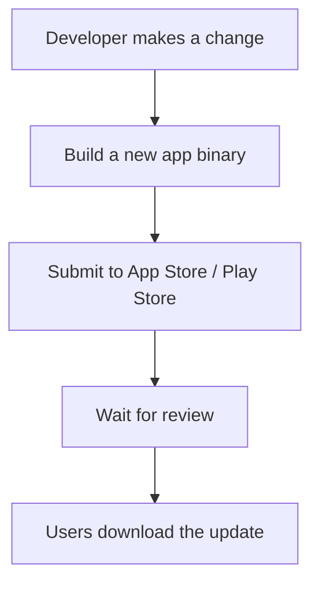
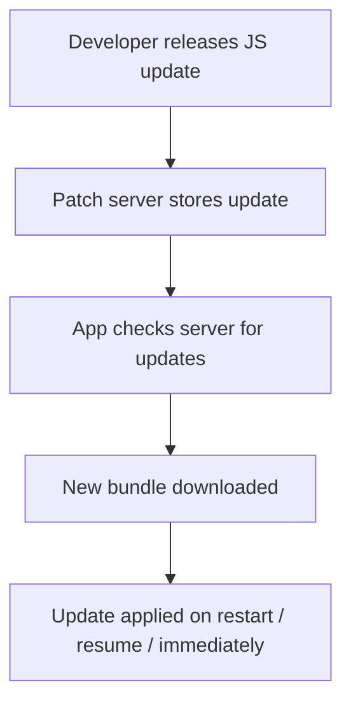
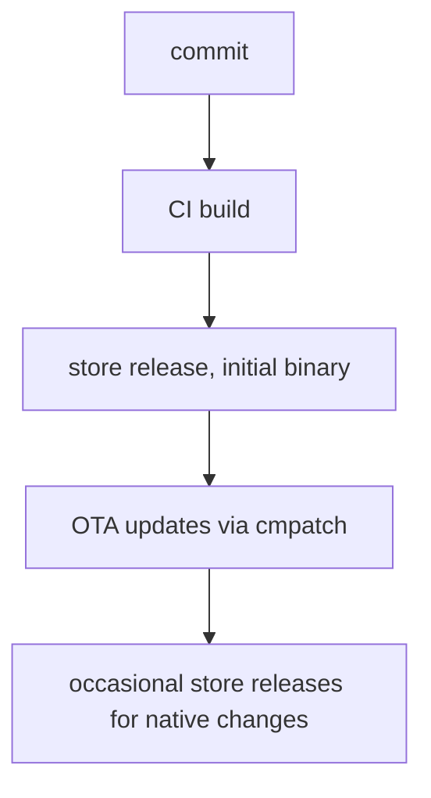

# Core concepts

This page explains how Codemagic Patch works at a conceptual level before setup or commands. Understanding the update model makes configuration and releases easier to follow.

## The problem: slow app store updates

By default, shipping a mobile app update looks like this:

This process is slow and rigid: reviews take hours or days, urgent fixes are delayed, and users must manually update.

## The idea: over-the-air (OTA) updates

Codemagic Patch enables OTA updates for React Native apps. Instead of distributing a new binary, the app downloads an updated JavaScript bundle from your server:

Typical OTA use cases:

- Hotfixes for production bugs
- UI tweaks or styling updates
- Feature flag or configuration changes
- Staged feature rollouts

## JavaScript layer vs native layer

React Native apps contain two layers.

The native layer is compiled platform code (Swift/Objective-C on iOS, Java/Kotlin on Android): platform integrations, native modules, permissions, and the app binary. Changes here require a new store release.

The JavaScript layer is your React Native application: UI, business logic, navigation, state, and bundled static assets. Patch updates this JavaScript bundle and its assets as long as they remain compatible with the installed native binary.

### What can and cannot be updated

OTA-safe (JavaScript layer):

- JavaScript bug fixes
- UI or layout adjustments
- Styling changes
- Bundled images or static assets
- Feature flags or configuration logic

Requires a new app store release (native layer):

- Adding or modifying native modules
- Upgrading React Native or native dependencies
- Editing native config (`build.gradle`, `Info.plist`, etc.)
- Changing app permissions
- New platform-specific integrations

### Delta updates

When a binary patch is available, the SDK prefers the smaller patch and falls back to the full bundle if the patch fails. This keeps updates fast and reduces bandwidth compared to re-downloading the entire bundle every time.

## Deployment model

Patch organizes updates using apps and deployments.

| Concept | What it is |
| --- | --- |
| App | A logical application. Use a separate app per platform (e.g. `MyApp-iOS`, `MyApp-Android`). |
| Deployment | A release channel inside an app. Every app is created with `Staging` and `Production`. |
| Deployment key | The public identifier the SDK uses to fetch updates. Found via `cmpatch deployment list`. Not a secret, it's baked into the app binary. |
| Release | A published bundle targeting one deployment + binary version. Identified by a label like `v1`. Supports gradual rollout, mandatory updates, and rollback. |
| Binary version | The native app version a release targets (e.g. `1.2.3`). The SDK only installs releases that match the running binary version. |
| Fingerprint | A hash of the native project. Guards against shipping a JS bundle to an incompatible native binary. |

Recommended workflow:

Each deployment has a deployment key embedded in the app. Development builds typically use `Staging`; production builds use `Production`. This keeps test updates away from end users.

:::warning
Always use separate deployment keys for iOS and Android. The manifest path does not include the platform, so reusing one key across both platforms (with the same binary version) lets releases overwrite each other.
:::

## Prerequisite: a native build with the SDK

The SDK must already be present in the native binary on each user's device. A store build without the SDK cannot install OTA updates, `cmpatch release-react` will still publish, but no client will pick it up.

When you first add Patch to an existing app:

1. Integrate the SDK ([Native setup](/docs/setup/native-setup)).
2. Produce a native build that includes the SDK and the deployment key you want to target.
3. Install that build on the devices that should receive updates, local/QA for `Staging`, App Store / Play Store for `Production`.
4. Only then ship JS changes to that deployment as OTA updates.

After that, the usual pattern applies: occasional native releases for native changes, OTA releases for everything else.

## Where Patch fits in the release process

Traditional:

With Patch:

This lets teams ship small fixes and improvements between full app store releases.
