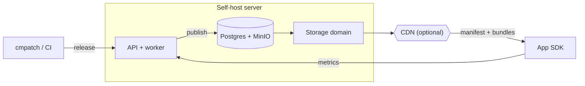

# How it works

1. You publish a release with the CLI. It bundles your JS, computes a fingerprint, resolves a target binary version, and uploads to the API, which stores the artifact and manifest in object storage.
2. On launch (or resume), the SDK fetches the manifest from your download base URL (the storage domain, or a CDN in front of it), not the API. It downloads the new bundle (or a smaller binary patch when available) from URLs in the manifest, then swaps it in on the next restart.
3. The SDK reports download/install/success/failure metrics to the API control plane.

Without a CDN, `CodemagicPatchDownloadBaseUrl` points at the storage domain directly (the CDN hop is skipped).

The default self-host stack runs four services on a single Docker host:

| Service | Role |
| --- | --- |
| Caddy | HTTPS/TLS (Let's Encrypt), API reverse proxy, dashboard, storage-domain proxy |
| Server | API + release worker in one process (`MODE=all`) |
| PostgreSQL | Control-plane data: apps, deployments, releases, IAM, metrics |
| MinIO | S3-compatible object storage for public artifacts and internal uploads |
