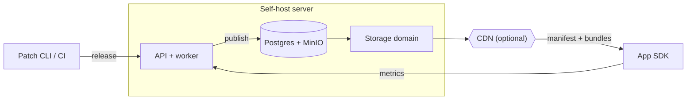

import SdkTabs from '@site/src/components/SdkTabs';
import TabItem from '@theme/TabItem';

# How it works

```mermaid
flowchart LR
  cli["Patch CLI / CI"] -->|release| api

  subgraph host["Self-host server"]
    direction TB
    api["API + worker"]
    store[("Postgres + MinIO")]
    edge["Storage domain"]
    api -->|publish| store --> edge
  end

  cdn{{"CDN (optional)"}}
  sdk["App SDK"]

  edge --> cdn -->|manifest + bundles| sdk
  sdk -->|metrics| api
```

<SdkTabs>
  <TabItem value="react-native" label="React Native">

1. You publish a release with the CLI. It bundles your JS, resolves a target binary version, and uploads to the API, which stores the artifact and manifest in object storage.
2. On launch (or resume), the SDK fetches the manifest from your download base URL (the storage domain, or a CDN in front of it), not the API. It downloads the new bundle (or a smaller binary patch when available) from URLs in the manifest, then swaps it in on the next restart.
3. The SDK reports download/ready/applied/failure metrics to the API control plane.

  </TabItem>
  <TabItem value="capacitor" label="Capacitor">

1. You build the web app and publish its `webDir` (usually `www/`) with `cmpatch-capacitor release create`, specifying the target native app version. The API stores the artifact and manifest in object storage.
2. On launch (or resume), the SDK fetches the manifest from your download base URL (the storage domain, or a CDN in front of it), not the API. It downloads the new bundle (or a smaller binary patch when available) from URLs in the manifest, then points the WebView at that directory on the next restart.
3. The SDK reports download/ready/applied/failure metrics to the API control plane.

  </TabItem>
</SdkTabs>

Without a CDN, the SDK's download base URL (`CodemagicPatchDownloadBaseUrl` for React Native, `downloadBaseUrl` for Capacitor) points at the storage domain directly (the CDN hop is skipped).

The default self-host stack runs four services on a single Docker host:

| Service | Role |
| --- | --- |
| Caddy | HTTPS/TLS (Let's Encrypt), API reverse proxy, dashboard, storage-domain proxy |
| Server | API + release worker in one process (`MODE=all`) |
| PostgreSQL | Control-plane data: apps, deployments, releases, IAM, metrics |
| MinIO | S3-compatible object storage for public artifacts and internal uploads (the PGSTY Silo build, a maintained MinIO fork) |
